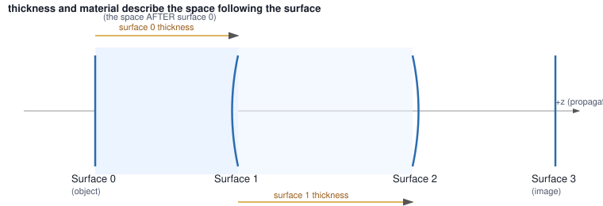

.. _conventions:

Conventions
===========

This page explains the model every Optiland lens is built on. Read it once and the rest of the
tutorials stop needing to re-explain it. It answers the question newcomers hit first: *why does a
lens look like a list of surfaces, and what do these surface parameters actually mean?*

----

The Surface-Sequential Model
-----------------------------

An Optiland ``Optic`` is not a list of lenses — it is a list of **surfaces**. A single glass
lens element is therefore *two* surfaces (front and back), not one:

.. code-block:: python

   lens = optic.Optic()
   lens.surfaces.add(index=0, thickness=float("inf"))                     # object
   lens.surfaces.add(index=1, radius=50.0, thickness=5.0, material="N-BK7", is_stop=True)
   lens.surfaces.add(index=2, radius=-50.0, thickness=40.0)                # back of the lens
   lens.surfaces.add(index=3)                                              # image

Rays are traced through surfaces in index order, refracting or reflecting at each interface in
turn. Everything else in Optiland — aberration analysis, optimization, tolerancing — operates on
this same ordered surface list.

----

The "After" Rule
-----------------

This is the single most common source of confusion for newcomers, so read it twice:

    **A surface's ``thickness`` and ``material`` describe the space that follows it** — not the
    space before it.

When you write ``lens.surfaces.add(index=1, thickness=5.0, material="N-BK7")``, you are not
describing surface 1 itself; you are describing the 5 mm of N-BK7 glass that lies *between*
surface 1 and surface 2.

   Surface 0's ``thickness`` is the object distance — the space between surface 0 and surface 1.
   Surface 1's ``thickness`` and ``material`` describe the glass between surface 1 and surface 2.

A practical consequence: the material you pass to ``surfaces.add()`` for surface *N* is the glass
*inside* the lens element that surface starts, and the surface that *closes* that element (the
next one) is normally left at the default ``"air"``.

----

.. _opt005:
.. _opt007:

Index 0 Is the Object; the Last Index Is the Image
-----------------------------------------------------

- **Surface 0** is always the object surface. For an object at infinity, give it an infinite
  thickness (``thickness=float("inf")``); for a finite conjugate, use the actual object distance.
- **The last surface** is always the image surface. Optiland does not require you to mark it
  explicitly — it is inferred from position in the list.
- Surfaces must be **added in index order**, starting from 0. Trying to add index 3 before index 1
  exists raises an ``IndexError`` naming the current surface count and the valid range.

----

.. _opt008:
.. _opt010:

Sign Conventions
------------------

- **Propagation direction**: light travels left to right, along the **+z axis**.
- **Radius of curvature**: positive means the center of curvature lies to the **right** of the
  surface (in the direction of propagation) — a convex surface facing the incoming beam has a
  positive radius. Negative means the center of curvature lies to the left. A flat surface has an
  infinite radius (``float("inf")``).
- **Thickness**: positive means the next surface lies further along +z (the normal case).
  Each ``is_stop=False``-style reflective surface (a mirror, ``material="mirror"``) flips the
  sign of every thickness that follows it, since propagation now runs the other way along z. A
  system with one mirror has negative thicknesses after it; a system with two mirrors (e.g. a
  Cassegrain) returns to positive thicknesses after the second one. This is why
  :func:`optiland.diagnostics.check_system` tracks the number of reflective surfaces seen so far
  before flagging a thickness sign as unexpected, rather than simply requiring every thickness to
  be positive.
- **Tilts and decenters**: rotations are applied in the order ``R = Rz @ Ry @ Rx`` about the
  surface's local coordinate system, applied *before* translation.

----

.. _opt001:
.. _opt002:
.. _opt009:

Units
------

Stated once, so no tutorial has to restate it:

======================  ==================
Quantity                 Unit
======================  ==================
Lens dimensions           millimeters (mm)
Wavelengths                microns (µm)
Angles                     degrees
======================  ==================

A system needs at least one wavelength, and exactly one of them must be marked
``is_primary=True`` — it is the one used for paraxial calculations and single-wavelength
analyses. Catalog materials (loaded from `refractiveindex.info <https://refractiveindex.info>`_)
carry a finite dispersion data range in microns; a wavelength that falls outside a material's
range produces unreliable index data, which is why
:func:`optiland.diagnostics.check_system` warns about it rather than staying silent.

----

.. _conventions_stop_aperture_pupil:
.. _opt003:
.. _opt004:
.. _opt011:

Stop, Aperture, and Pupil
----------------------------

These three terms are related but distinct, and newcomers routinely merge them:

- **Stop**: a physical surface in your system, marked with ``is_stop=True``. It is the surface
  that limits the cone of rays passing through the system for an on-axis field point. Marking the
  object or image surface as the stop is almost always a mistake.
- **Aperture**: the *system-level* specification of how large that cone is —
  ``lens.set_aperture(aperture_type="EPD", value=25)`` sets it via entrance pupil diameter, but it
  can also be specified via image-space f-number (``"imageFNO"``) or object-space numerical
  aperture (``"objectNA"``).
  A system needs exactly one stop surface and one aperture definition; :func:`optiland.diagnostics.check_system`
  flags either being missing or a stop placed on the object or image surface.
- **Pupil**: the *image of the stop* as seen from object space (entrance pupil) or image space
  (exit pupil). It is a derived, computed quantity — you never set a pupil directly, only the
  stop and the aperture that determines its size.

----

.. _conventions_fields:
.. _opt006:
.. _opt012:

Field Specification
----------------------

A field describes where on the object (or in what direction) a bundle of rays originates:

- **Field type** — ``lens.fields.set_type("angle")`` for angular fields (object at infinity, most
  common for imaging lenses) or ``"object_height"`` for a field specified as a physical height on
  a finite-conjugate object.
- **Adding a field** — ``lens.fields.add(y=10.0)`` for a single field; ``x`` and ``y`` follow the
  same units as the field type (degrees for angle, mm for object height).
- **Normalized coordinates (Hx, Hy)** — internally, ray tracing and analysis methods
  (``lens.trace(Hx, Hy, wavelength)``) take *normalized* field coordinates in ``[-1, 1]``, where 1
  corresponds to the maximum field defined on the system. Use
  ``lens.fields.get_field_coords()`` to convert your defined fields into this normalized form.

----

Still stuck on a specific error? Run :func:`optiland.diagnostics.check_system` on your ``Optic`` —
it names the offending surface or object and gives you a runnable fix.
